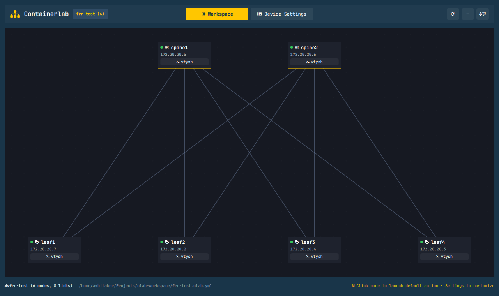
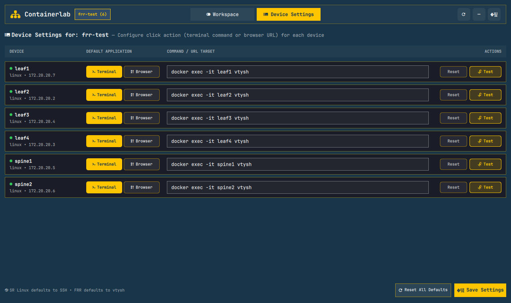

# Omarchy Containerlab Workspace Plugin

A native [Omarchy](https://omarchy.org/) and Hyprland plugin that integrates [Containerlab](https://containerlab.dev/) network topologies directly into your desktop environment.

It provides a status bar widget, an interactive graphical topology visualizer inside a dedicated private workspace (`special:clab`), and customizable per-node application launching (terminals, SSH, Docker exec, or web browsers).



---

## Features

- 📊 **Status Bar Widget**:
  - Displays the active topology and running node count (` <count>`).
  - **Left-click**: Smart toggle — summons the topology canvas or switches to the workspace.
  - **Right-click**: Toggles the dedicated `special:clab` workspace directly.

- 🌌 **Dedicated Private Workspace (`special:clab`)**:
  - Keeps all network lab windows isolated from your primary desktop workspaces.
  - Jump in and out instantly with a single shortcut without disrupting your ongoing tasks.

- 🕸️ **Interactive Floating Topology Canvas**:
  - Renders the network topology graph dynamically based on Containerlab YAML files and `.annotations.yaml` coordinates.
  - Displays interconnecting links between nodes and real-time running/stopped status badges.
  - Stays as a floating window centered on top of open terminal windows.
  - **Left-click**: Instantly launches the node's shell as a standalone terminal titled with the node name.
  - **`SHIFT + Left-click`**: Opens the shell in Hyprland **grouped mode** (as a tab) in the last shell opened or active in the workspace, with each tab titled with the node name.

- ⚙️ **Per-Node Application Launcher & Settings**:
  - Automatic defaults based on device type:
    - **Nokia SR Linux**: Terminal with SSH connection (`ssh -l admin <ip>`).
    - **FRRouting (FRR)**: Terminal with vtysh (`docker exec -it <node> vtysh`).
    - **Linux / Other**: Terminal with Docker exec interactive bash shell.
  - Built-in **Settings** tab to customize each node:
    - Choose application type: **Terminal** or **Web Browser**.
    - Customize target command (e.g. `ssh`, `vtysh`, `telnet`, `docker exec`) or Web UI URL (e.g. `http://localhost:8080`).
    - Settings persist in `~/.config/omarchy/containerlab/settings.json`.
    - Auto-refresh protection prevents input overwrite while editing settings.

  

- 📜 **Scrolling Layout Support (`SUPER + L`)**:
  - Toggle between Hyprland dwindle tiling and scrolling layouts directly within `special:clab` without affecting other workspaces.

---

## Keybindings & Interactions

| Shortcut / Interaction | Action |
| :--- | :--- |
| **`Click`** *(on node)* | Launch node application in a new standalone window |
| **`SHIFT + Click`** *(on node)* | Open node shell in **grouped mode (tabs)** inside last active shell |
| **`SUPER + ALT + C`** | **Smart toggle Containerlab**: Shows/hides floating topology window |
| **`SUPER + ALT + SHIFT + C`** | Toggle `special:clab` workspace visibility |
| **`SUPER + L`** | Toggle workspace layout (dwindle ↔ scrolling) on current workspace |
| **`Esc`** *(inside topology)* | Minimize / hide topology window to reveal terminals behind it |

---

## Installation

Install directly using the native Omarchy plugin manager:

```bash
omarchy plugin add https://github.com/andywhitaker/omarchy-clab-workspace.git --enable
```

All Hyprland window rules, special workspace routing (`special:clab`), and keybindings are automatically managed at runtime by the plugin's background service (`ContainerlabService.qml`). **No manual edits to `~/.config/hypr/` are required.**

### Local Development Setup

To link and run the plugin directly from a local git clone:

```bash
git clone https://github.com/andywhitaker/omarchy-clab-workspace.git ~/Projects/omarchy-clab-workspace
ln -s ~/Projects/omarchy-clab-workspace ~/.config/omarchy/plugins/awhitaker.clab-workspace
omarchy-shell shell rescanPlugins
omarchy plugin enable awhitaker.clab-workspace
```

---

## Plugin Architecture

```
omarchy-clab-workspace/
├── assets/
│   ├── topology-view.png # Topology visualizer screenshot
│   └── settings-view.png # Device settings UI screenshot
├── manifest.json         # Omarchy plugin manifest (panel + bar-widget + service)
├── BarWidget.qml         # Status bar widget displaying node count
├── Overlay.qml           # Floating window wrapper with tabs and title bar
├── WorkspaceView.qml     # Dynamic canvas visualizer for network topologies
├── SettingsView.qml      # Device launch application configuration UI
├── ContainerlabService.qml # Dynamic Hyprland rules & keybindings service
├── backend.py            # Python engine: clab inspection, persistence, app launcher
├── bin/
│   └── omarchy-hyprland-workspace-layout-toggle  # Special workspace layout switch
└── README.md             # Documentation
```

---

## Requirements

- **Omarchy Linux** (Hyprland + `omarchy-shell`)
- **Containerlab** (`containerlab` CLI on PATH or sudo privileges)
- **Docker**
- **Python 3** (with `pyyaml`)

---

## License

MIT
